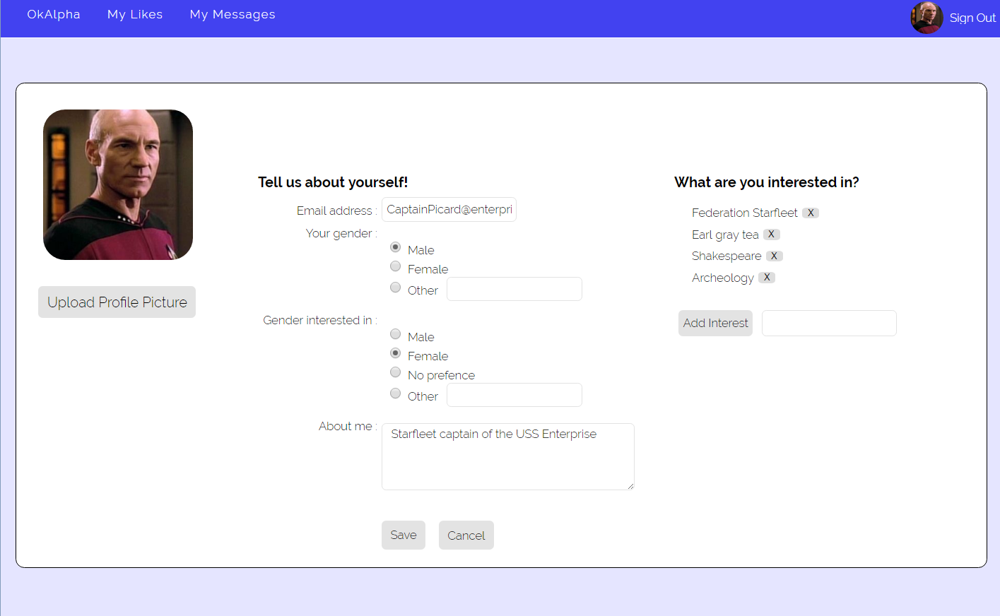

# OkAlpha

[Live](https://okalpha.herokuapp.com/)

OkAlpha is a full-stack web application inspired by OkCupid.  It's built with Ruby on Rails on the backend, a PostgreSQL database, and React.js with a Flux architectural framework on the frontend.  

## Features

OkAlpha is a dating and match-making web application for the Alpha Quadrant. With OkAlpha, members of the Alpha Quadrant can:

* Create an account
* Log in / Log out
* Send in-app messages
* Create and edit their user profile
* Upload a profile picture
* Browse profiles of other users
* Search for specific users
* Look at recommended matches based on mutual interests
* Let users select people they're "like" and see who has "liked" them

### Single-Page App

OkAlpha is a single-page app once you get past the signup page. The root page renders content specific to a user based on the session token. If nobody is logged in, the app redirects you to the signup page.

```ruby
class SessionsController < ApplicationController
  def create
    @current_user = User.find_by_credentials(
      params[:user][:username],
      params[:user][:password]
    )
    if @current_user
      session[:session_token] = @current_user.reset_token!
      redirect_to root_url
    else
      flash.now[:errors_login] = ["Invalid username or password"]
      render :new
    end
  end
end
```

### Database Schema

OkAplha is built with 4 tables: users, interests, messages, and likes. Each table has its own store. When a user logs in, all of his or her personal data is collected from the database and stored in these stores. For example, to obtain all of a user's messages, an API request is made to the database which joins the user table and the message table polymorphically on both `receiver_id` and `sender_id`. Then, if just viewing these messages, calls to the store are made when refreshing, instead of pinging the database too often.

* [DB schema][schema]
[schema]: ./docs/schema.md

### Components

There are several different components in OkAlpha. For example, a user's edit-profile page is made up of 3 main components: the upload picture form using Cloudinary called `Cloud`, the form to add interests called `Interests`, and the component that wraps them all together along with the personal details form called `UserForm`.



```javascript
return (
  <div className="profile-cont">
    <div className="profile-form">
      <Cloud key={user.id} user={user}/>
      {profileForm}
      <Interests user={user}/>
    </div>
  </div>
);
```

## Future Ideas

There are still a few features I'd like to add to OkAlpha in my spare time:
* The ability to mark messages as unread
* The ability to search messages
* The ability to see messages from one user or subject line bundled in a thread
* Fix the delete messages API so it takes both sender and receiver to delete
* Implement more complicated matching algorithms
